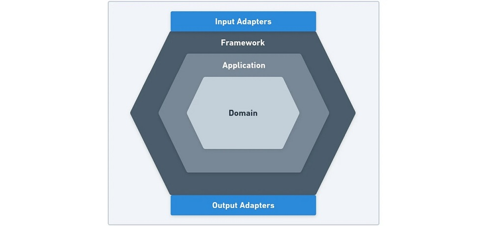

# Chapter 1

## Introduction
This `org.metable.hex.ch01.*` series of projects (and the other chapter examples to follow) are based on
examples taken from the book "Designing Hexagonal Architecture with Java" by Davi Viera.

The examples from the book are altered to use the Eclipse Modeling Framework (EMF) as the persistence framework.

This work is an exploration to discover how EMF might be adapted to a hexagonal architecture. 

## The Hexagonal Architecture 

The goal of a hexagonal architecture is to keep problem domain code separate from implementation technology code.

Generally, representing the problem domain is restricted to using a sufficiently expressive language of choice and
its standard library to encode problem domain concepts.

Technology code (e.g., UI and persistence frameworks) is expressed using the language of the chosen solution. 

Technology code can depend on problem domain code, but not vice-versa. Technology code must be adapted to the
the problem domain code. In this way, technology code can change with no impact on the problem domain
representation.

The hexagonal architecture can be graphically represented as 3 concentric hexagons.

    

The inner most hexagon is the Domain hexagon. Surrounding the Domain hexagon is the Application hexagon. The outer
most hexagon is the Framework hexagon surrounding the Application hexagon. This way of depicting the architecture
emphasizes the requirement that the direction all dependencies is from the outside in. At the center of the
architecture is the domain, whichs is independent of all other parts of the architecture. 
